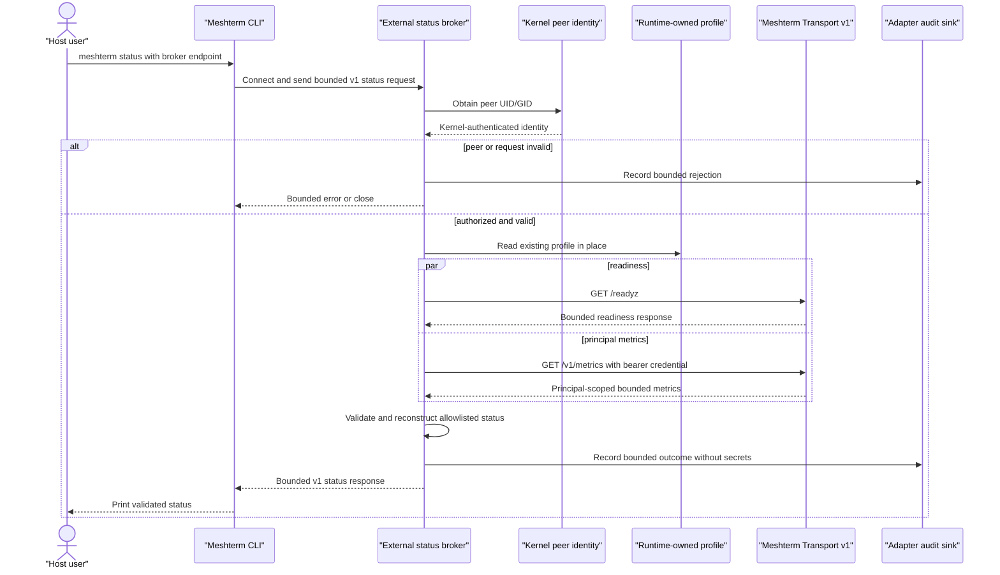

# Credentialless Status Broker Split — Technical Design

## Architecture Overview

The design separates a reusable Meshterm client contract from a
deployment-specific credential broker.

Meshterm core gains a credentialless local-client path for `status`, plus a
small, versioned protocol and contract tests. It does not implement credential
custody, local identity policy, or container orchestration.

A separately packaged integration adapter runs inside the credential owner's
protected boundary. It authenticates the connecting peer using a kernel
primitive, reads the existing profile in place, performs two fixed Meshterm
requests, constructs a bounded response, and records a redacted audit event.

This is a capability-narrowing adapter, not a new Transport v1 authorization
model. The underlying credential remains principal-wide.

## Actual State

- `packages/cli/index.ts` loads a JSON profile containing `server` and
  `credential` for `status`.
- Current `status` concurrently requests unauthenticated `GET /readyz` and
  credential-authenticated `GET /v1/metrics`.
- `packages/server/server.ts` scopes principal metrics to the authenticated
  recipient.
- Transport v1 credentials authenticate a principal; they have no command or
  endpoint scopes.
- The current Bun socket API is not assumed to expose Linux peer UID/GID.
- No upstream broker protocol or credentialless CLI broker mode exists.

## Ideal State

- A host can run native `meshterm status` without a local credential.
- Any external runtime can implement the generic status broker contract.
- The Kage credential remains readable only inside its current Hermes-owned
  boundary.
- Unauthorized or malformed calls are rejected before profile or network
  access.
- The adapter cannot be used for arbitrary Meshterm or HTTP operations.
- Deployment and credential rotation remain separately approved operations.

## Gap Analysis

| Gap | Resolution owner |
|---|---|
| CLI requires a credential profile | Meshterm core: explicit broker client mode |
| No stable local status protocol | Meshterm core: versioned closed contract |
| No shared schema/bounds | Meshterm core: validators, types, fixtures, tests |
| Credential must remain runtime-owned | External adapter: in-place profile access |
| Local caller needs strong identity | External adapter: kernel peer credentials |
| Status credential permits more than status | External adapter: fixed-operation policy |
| Upstream responses may evolve | External adapter: validate and reconstruct allowlisted output |
| Runtime/socket/container policy is deployment-specific | External adapter and deployment package |
| Rollback could accidentally rotate credentials | Deployment runbook: remove integration only |

## Components and Ownership

| Component | Responsibility | Proposed location | Owner |
|---|---|---|---|
| Broker protocol types | Closed v1 request, response, and errors | `packages/client/broker.ts` | Meshterm core |
| Broker client | Connect, frame, bound, validate, time out | `packages/client/broker.ts` | Meshterm core |
| CLI broker mode | Explicitly select broker endpoint for `status` | `packages/cli/index.ts` | Meshterm core |
| Contract fixtures/tests | Verify conforming and hostile broker behavior | `packages/client/broker.test.ts`, CLI tests | Meshterm core |
| Generic protocol docs | Explain contract without runtime assumptions | `docs/STATUS_BROKER.md` | Meshterm core |
| Credential broker server | Authenticate peer and serve exactly `status` | External integration package, path TBD | Integration owner |
| Profile loader | Read existing runtime profile in place | External integration package | Integration owner |
| Meshterm status adapter | Fixed readiness/metrics calls and filtering | External integration package | Integration owner |
| Socket and audit policy | UID/GID, directory, mode, limits, audit sink | External deployment package | Integration owner |
| Hermes/home-lab packaging | Sidecar/service/container and bind mount | External deployment package | Home-lab owner |

The external package location must be selected during the adapter
implementation approval. It must not be added to Meshterm merely for
convenience.

## Protocol Design

### Transport

- A local byte-stream endpoint selected explicitly by the CLI.
- Initial supported transport: filesystem Unix-domain socket.
- One request and one response per connection.
- UTF-8 JSON followed by newline.
- Maximum request and response sizes are compile-time contract constants.
- No streaming, batching, multiplexing, compression, negotiation, or fallback.
- The CLI closes the connection after one bounded response.

The contract describes the endpoint behavior; it does not prescribe how an
adapter discovers credentials, authorizes users, or is deployed.

### Request

```json
{
  "version": 1,
  "request_id": "018f4f68-2dc3-7d70-9c3a-8f905f8d57d8",
  "operation": "status"
}
```

Rules:

- `version` is exactly `1`.
- `request_id` is generated by the CLI and must satisfy a bounded identifier
  grammar.
- `operation` is exactly `status`.
- Unknown and duplicate fields are invalid.
- No parameters object exists in v1.

### Success response

```json
{
  "version": 1,
  "request_id": "018f4f68-2dc3-7d70-9c3a-8f905f8d57d8",
  "ok": true,
  "status": {
    "ready": true,
    "schema_version": 2,
    "journal_mode": "wal",
    "queue_depth": 0,
    "active_leases": 0,
    "acknowledged": 0,
    "dead_letters": 0,
    "discarded": 0,
    "retries": 0,
    "oldest_message_age_ms": 0,
    "average_delivery_latency_ms": 0
  }
}
```

All numeric fields are finite, non-negative, bounded integers except
`average_delivery_latency_ms`, which may be a finite, non-negative bounded
number. Unknown fields are rejected so protocol evolution requires review.

### Error response

```json
{
  "version": 1,
  "request_id": "018f4f68-2dc3-7d70-9c3a-8f905f8d57d8",
  "ok": false,
  "error": {
    "code": "upstream_unavailable",
    "message": "status is unavailable"
  }
}
```

Error codes form a small stable allowlist, such as:

- `unauthorized_peer`
- `invalid_request`
- `unsupported_version`
- `profile_unavailable`
- `upstream_unavailable`
- `upstream_unauthorized`
- `invalid_upstream_response`
- `audit_unavailable`
- `internal_error`

Messages are fixed, bounded, and contain no raw exception or upstream content.
An adapter may close without a response when responding would amplify malformed
or oversized input.

## CLI Configuration

Broker selection must be explicit and unambiguous. The implementation phase
will choose one host-neutral interface, such as:

```text
meshterm status --broker-socket /run/user/1000/meshterm-status.sock
```

or an equivalent environment/config option with the same semantics.

Precedence rules:

1. An explicitly selected broker endpoint uses broker mode.
2. Broker mode never reads or falls back to a credential profile.
3. Without broker selection, existing direct credential-backed behavior remains
   unchanged.
4. Broker configuration contains only endpoint and safe client limits, never a
   credential, server URL, upstream path, or authorization policy.

## External Adapter Policy

The reference integration adapter must:

1. Accept a local connection.
2. Obtain UID/GID from the kernel.
3. Reject an unauthorized peer.
4. Read and validate one bounded request.
5. Reject anything other than protocol v1 `status`.
6. Load the deployment-owned Meshterm origin and existing profile in place.
7. Request `GET /readyz` without authorization.
8. Request `GET /v1/metrics` with the runtime-owned bearer credential.
9. Validate both response status codes, byte bounds, JSON, and schemas.
10. Reconstruct the contract response from allowed fields.
11. Write one redacted audit event.
12. Return one bounded response and close.

It must not accept caller-controlled URLs, paths, methods, headers, bodies,
credentials, profile names, timeouts, filter expressions, or audit fields.

## Sequence Diagram



## Trust Boundaries

```text
Host trust domain
  credentialless Meshterm CLI
        |
        | dedicated Unix socket only
        v
Runtime trust domain
  adapter -> protected profile -> fixed HTTPS Meshterm origin
        |
        `-> redacted integration-owned audit sink
```

The socket crosses trust domains. Filesystem permissions restrict discovery and
connection; kernel peer credentials make the authorization decision. The
request body is never identity evidence.

## Feasibility Gate: Kernel Peer Identity

Before adapter implementation:

1. Select a Linux-capable runtime or minimal helper exposing `SO_PEERCRED`.
2. Prove it returns the actual UID, primary GID, and any required group
   semantics for a Unix-socket client.
3. Test allowed UID, allowed group, unauthorized user, forged JSON identity,
   inherited file descriptor, and container/user-namespace cases.
4. Document whether supplementary group authorization can be evaluated
   reliably. If not, authorize a dedicated UID or use a deployment design whose
   kernel evidence is unambiguous.
5. Stop if peer identity cannot be obtained before request processing.

Bun Unix-socket support alone is insufficient evidence. The broker may use a
small implementation in a runtime with direct peer-credential support while
the Meshterm CLI and protocol remain TypeScript/Bun.

## Threat Controls by Layer

| Threat | Core client control | External adapter control |
|---|---|---|
| Host credential theft | Broker mode never reads a profile | Profile remains runtime-only |
| Caller identity spoofing | No identity fields in request | Kernel peer credentials |
| Generic proxy abuse | Closed one-operation schema | Fixed GET/path allowlist |
| Oversized/slow client | Client request and response bounds | Read/deadline/concurrency limits |
| Malicious upstream body | Strict response schema | Pre-parse byte cap and reconstruction |
| Secret leakage | Bounded stable client errors | Redacted errors and audit |
| Protocol downgrade | Exact version validation | Exact version validation |
| Partial misleading status | Reject incomplete response | All-or-nothing readiness plus metrics |

## Alternatives Considered

### General credential-bearing broker in Meshterm core

Rejected. Credential custody, peer policy, and service supervision are
deployment concerns. A generic credential broker would expand Meshterm from
transport into local authorization and secret-management infrastructure.

### Hermes-specific broker inside Meshterm

Rejected. It couples the generic transport repository to Hermes, container
paths, bind mounts, and Ken's home-lab topology.

### Copy, symlink, bind-mount, or ACL-expand the profile to the host

Rejected. Each option makes the principal-wide credential host-readable and
breaks the protected runtime boundary.

### Create another credential for the Kage principal

Rejected for the initial design. It does not narrow endpoint authority and
adds another principal-wide bearer credential.

### Create a separate status principal

Rejected. Principal metrics are recipient-scoped, so another principal cannot
observe the Kage mailbox metrics.

### Root or Docker helper

Not selected as the target architecture. It can simplify filesystem access but
increases privilege and operational blast radius. It may be evaluated only as
a deployment-specific fallback under separate approval.

### Caller-supplied UID/GID

Rejected. Request data is attacker-controlled and cannot authenticate the peer.

### Generic HTTP or command passthrough

Rejected. It would turn a narrowly reviewed status capability into access to
the full principal credential authority.

### Change Transport v1 to command-scoped credentials now

Deferred and out of scope. It is a server authentication redesign with wider
migration impact; this feature must not smuggle it into a local integration.

## Testing Strategy

### Meshterm core contract tests

- Valid request/response round trip through a fake broker.
- Missing socket and connection refusal.
- Timeout, early close, truncated frame, multiple frames, trailing bytes.
- Oversized request or response.
- Invalid UTF-8/JSON, duplicate keys, unknown fields, wrong version.
- Mismatched request identifier.
- Invalid metric types, negative/non-finite/out-of-range values.
- Stable redacted error rendering.
- Proof that broker mode does not load a credential profile.
- Regression proof for existing direct status mode.
- Static scan proving upstream files contain no integration-specific names.

### External adapter tests

- Kernel peer identity feasibility matrix.
- Authorized and unauthorized UID/GID behavior.
- Forged request identity has no effect.
- Invalid requests cause zero profile reads and zero network calls.
- Only the two fixed GET requests are possible.
- Fixed origin cannot be overridden.
- Profile remains in place and is never logged or copied.
- Upstream auth, timeout, TLS, malformed body, large body, and schema failures.
- Response allowlist excludes unknown upstream fields.
- Audit contains allowed metadata and no credential, header, payload, lease
  token, profile content, or raw response.
- Connection, concurrency, request, response, and deadline limits.
- Socket ownership/mode and dedicated runtime-directory checks.

### Integration tests

- Native host CLI to adapter to fake Meshterm end to end.
- Container/user-namespace peer identity behavior on the target topology.
- Adapter restart and stale-socket recovery.
- Runtime restart without changing the credential profile.
- Cutover coexistence with current Hermes access.
- Rollback leaves existing Hermes Meshterm behavior unchanged.

## Operational Design

### Installation boundary

- Core CLI is installed independently of the external adapter.
- The adapter receives a dedicated runtime socket directory bind mount, not a
  runtime data or credential directory.
- The host sees only the socket endpoint.
- Socket ownership/group and membership changes are listed explicitly during
  deployment review.

### Cutover

1. Confirm all implementation and security gates passed.
2. Record current host CLI, runtime, profile metadata, and status behavior
   without exposing secrets.
3. Start the adapter with no host client enabled.
4. Verify socket ownership, peer authorization, audit, and fixed upstream calls.
5. Enable broker mode for host `status`.
6. Verify native status and confirm the host has no profile access.
7. Observe bounded logs and resource use before declaring cutover complete.

### Rollback

1. Disable host broker configuration.
2. Remove host access to the dedicated socket path.
3. Stop and remove the adapter service/sidecar.
4. Remove only the dedicated runtime socket bind mount and directory.
5. Verify Hermes still reads its unchanged profile and retains its existing
   Meshterm behavior.
6. Do not revoke, rotate, copy, or modify the credential during rollback.

## Dependencies and Risks

- The external adapter requires a proven Linux kernel peer-credential API.
- Container user namespaces can change observed UID/GID semantics.
- Supplementary group membership may not be directly available from
  `SO_PEERCRED`; deployment policy must avoid ambiguous authorization.
- The audit sink's failure policy must be selected and tested before deployment.
- Closed response schemas require deliberate protocol versioning when Meshterm
  metrics evolve.
- Principal-scoped metrics may be misread as global health unless labeled
  clearly.

## Approval Boundaries

- Approval of this document permits no source implementation.
- Core implementation requires approval of exact Meshterm files and behavior.
- Adapter implementation requires approval of its repository, runtime, and
  peer-identity approach.
- Deployment requires a reviewed target-host plan and separate approval.
- Credential issuance, revocation, or rotation requires a later independent
  approval.
